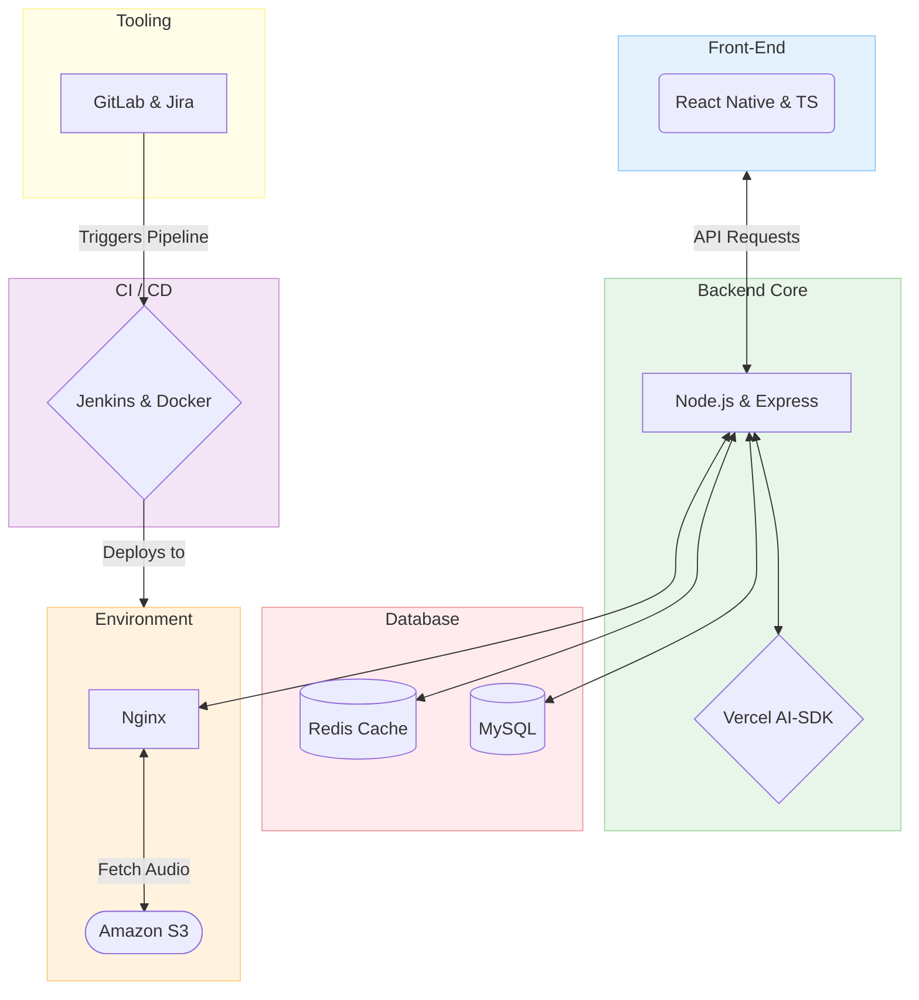

 2026-06-01 16:25

Status:

Tags:

# Darija Genie Architecture

#### Model View Controller (For separation of Concern between Client and Server)

The **MVC** has three components
1) Model : For Data handling
2) View: For Data Presentation
3) Controller that handles Events

![[Pasted image 20260601162856.png]]
(1)
#### MPV (For Client side)

![[Pasted image 20260601162904.png]]
(1)

**CI/CD**: We will use Jenkins and Docker to containerize the application and simplify making changes and delivering new software versions.

### References

1) [Architecture](https://khalilstemmler.com/articles/client-side-architecture/architecture)

---

